# ChronoLog Documentation

## Project Information

* **Project Name**: ChronoLog
* **Author**: Miro Slezák
* **Date**: 24.12.2025
* **Institution**: Střední průmyslová škola elektrotechnická, Praha 2, Ječná 30
* **Subject**: Information Technology

## Overview

ChronoLog is a high-performance parallel log analyzer designed to process large log files efficiently. It supports both live (real-time) and batch processing modes, automatically detecting errors, warnings, and custom metrics while producing structured outputs suitable for downstream visualization tools.

## Business Requirements

### Executive Summary
This tool addresses the critical need for efficient log analysis in high-volume environments. It transforms raw, unstructured log data into actionable business intelligence, enabling teams to detect issues faster and optimize system performance.

### Analysis
**The Challenge:** In today's data-driven environment, applications generate massive amounts of log data (gigabytes per day). Manual review of these logs is impossible, and standard text editors often crash when attempting to open such large files. This creates a blind spot where critical errors, security warnings, and performance bottlenecks can go unnoticed.

**The Solution:** ChronoLog addresses this by providing an automated, high-performance analysis tool. It is designed to ingest raw log data, parse it intelligently, and extract actionable insights.
*   **Batch Analysis:** Allows for historical audits and deep-dive troubleshooting of past incidents.
*   **Live Monitoring:** Provides real-time visibility into system health, enabling immediate reaction to emerging issues.

### Implementation
ChronoLog is engineered with a focus on **robustness** and **scalability**.
*   **Parallel Processing Engine:** Unlike traditional scripts that read one line at a time, ChronoLog utilizes the full power of modern multi-core processors. It splits the work across multiple "workers," allowing it to process millions of log lines in minutes.
*   **Enterprise-Grade Storage:** The system utilizes **Microsoft SQL Server** to store the analyzed data. This ensures that your data is safe, structured, and ready for complex reporting.
*   **Modular Architecture:** The system is built in distinct blocks (Reader, Processor, Writer). This means if one part needs an upgrade (e.g., changing the log format), it can be done without disrupting the entire system.

### Testing
To ensure reliability in a business context, the project employs a rigorous testing strategy:
*   **Unit Testing:** Individual components are tested in isolation (e.g., "Does the timestamp parser handle leap years correctly?").
*   **Integration Testing:** Full end-to-end runs are simulated to ensure that data flows correctly from the log file to the database.
*   **Stress Testing:** The system is subjected to massive datasets to guarantee it remains stable under heavy load, ensuring it won't fail when you need it most.

### Reasoning: Why and How?
*   **Why Python?** It allows for rapid development and maintenance, reducing the total cost of ownership.
*   **Why SQL Server?** Flat files (CSV/JSON) are difficult to query. SQL Server allows business users to ask complex questions (e.g., "Show me the error rate trend for the last quarter") and get instant answers.
*   **Why Parallelism?** Speed is money. Waiting hours for a log analysis is unacceptable. Parallel processing reduces turnaround time from hours to minutes.

### Requirement Models

### User Requirements

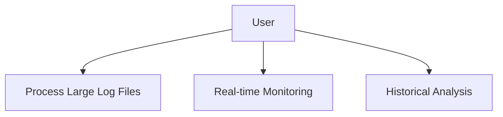

### Processing Requirements

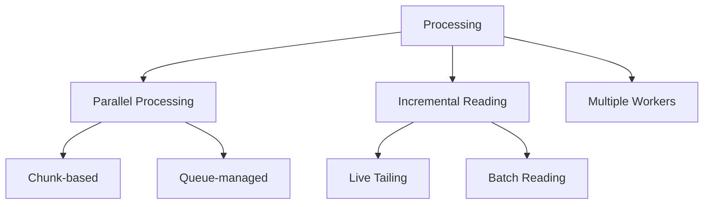

### Output Requirements

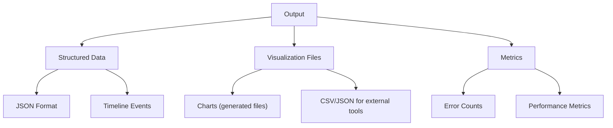

## System Architecture

### High-Level Architecture

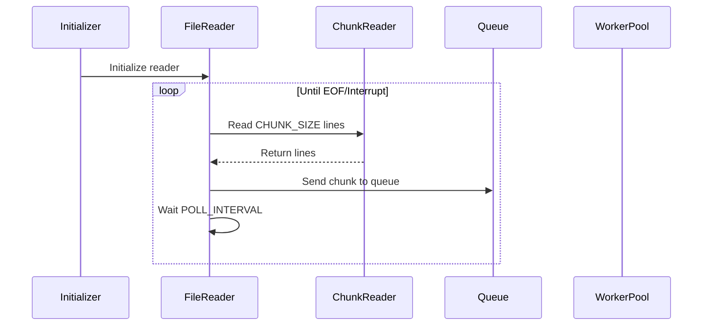

### Worker Processing Flow

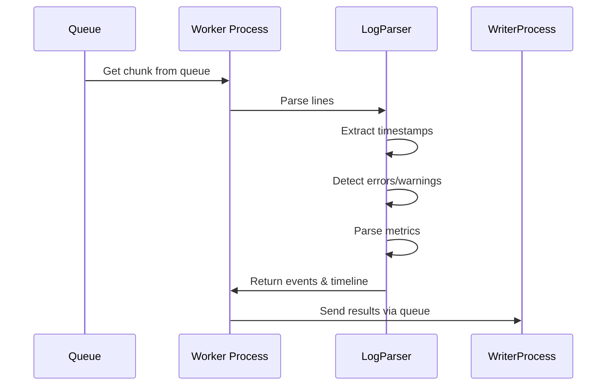

### Writing Output Flow

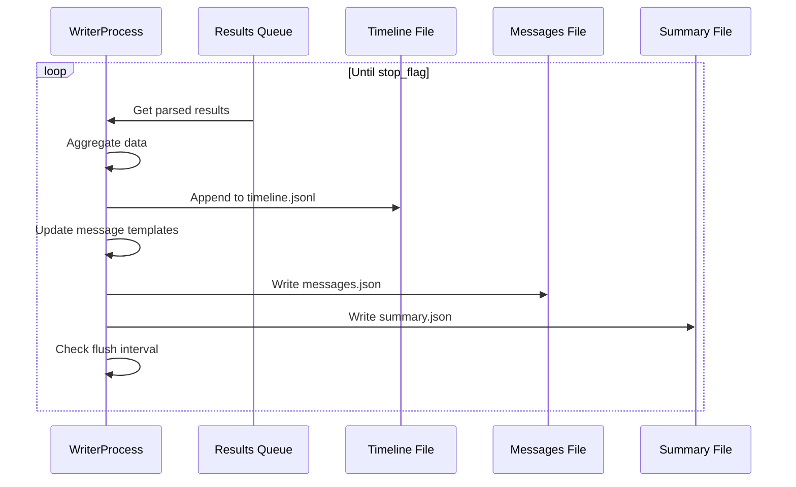

### Batch Mode Flow

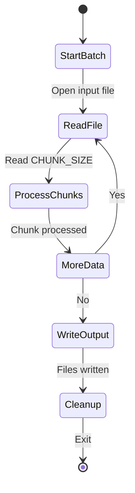

### Live Mode Flow

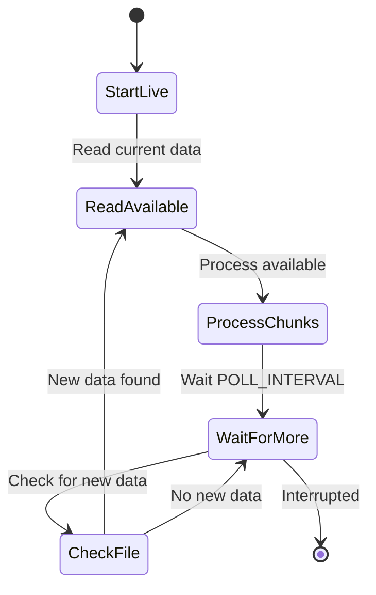

## Interfaces & Dependencies

### Third-Party Libraries

```text
# requirements.txt
python-dotenv>=0.20.0
pytest>=7.0
```

(Flask / web dashboard is **not** part of the core project. Visualization is produced as files to be consumed by external tools.)

### External Services

* None - standalone application

### System Requirements

* Python 3.9+
* Operating System: Windows/Linux/macOS
* Storage: Sufficient space for log files and output

## Legal & Licensing

### License Information

* **License**: MIT License
* **Copyright**: 2025 LostSoul
* **Permissions**: Commercial use, modification, distribution
* **Conditions**: Include original license
* **Limitations**: No warranty

### Copyright Notice

All original code is MIT licensed. Third-party libraries maintain their respective licenses.

## Configuration

### Environment Variables

```bash
# .env.example
INPUT_FILE_PATH=    # Path to input log file
CHUNK_SIZE=1000     # Lines per processing chunk
QUEUE_MAX_SIZE=10   # Max chunks in queue
POLL_INTERVAL=0.5   # Seconds between file checks
NUM_PROCESSES=3     # Worker processes count
OUTPUT_PATH=        # Output directory path
```

### Configuration Files

* **.env**: Environment variables (optional)
* **config.py**: Central configuration management

## Installation & Setup

### Quick Start

```bash
# 1. Generate sample log
python bin/generate_sample_log.py

# 2. Analyze logs (batch mode)
python src/main.py
```

### Detailed Installation

1. **Prerequisites**: Python 3.9+ in PATH
2. **Dependencies**: `pip install -r requirements.txt`
3. **Project Structure**:

   ```
   ChronoLog/
   ├── src/          # Core application
   ├── tests/        # Unit tests
   ├── input/        # Log files
   ├── output/       # Analysis results
   └── bin/          # Utilities
   ```

## Error Handling

### Common Error States

| Error Type      | Cause               | Resolution                          |
| --------------- | ------------------- | ----------------------------------- |
| FileNotFound    | Input file missing  | Check INPUT_FILE_PATH               |
| PermissionError | File access denied  | Adjust file permissions             |
| MemoryError     | Queue overflow      | Reduce CHUNK_SIZE or QUEUE_MAX_SIZE |
| ParserError     | Malformed log lines | Check log format                    |

### Error Recovery
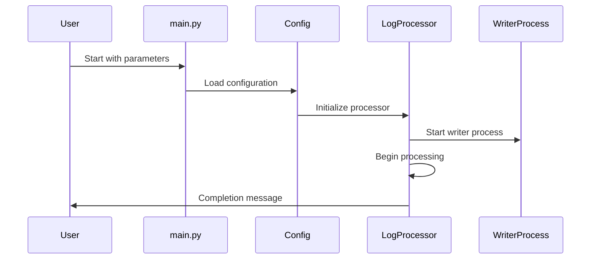

### File Reading Flow

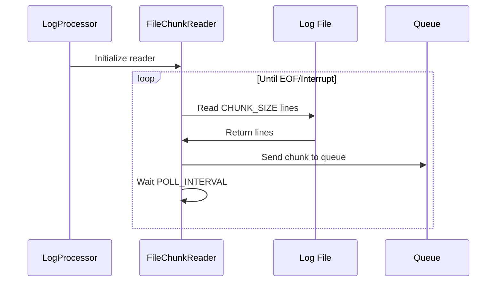

### Worker Processing Flow


### Writing Output Flow


### Batch Mode Flow


### Live Mode Flow


## Interfaces & Dependencies

### Third-Party Libraries

```text
# requirements.txt
python-dotenv>=0.20.0
pytest>=7.0
```

(Flask / web dashboard is **not** part of the core project. Visualization is produced as files to be consumed by external tools.)

### External Services

* None - standalone application

### System Requirements

* Python 3.9+
* Operating System: Windows/Linux/macOS
* Storage: Sufficient space for log files and output

## Legal & Licensing

### License Information

* **License**: MIT License
* **Copyright**: 2025 LostSoul
* **Permissions**: Commercial use, modification, distribution
* **Conditions**: Include original license
* **Limitations**: No warranty

### Copyright Notice

All original code is MIT licensed. Third-party libraries maintain their respective licenses.

## Configuration

### Environment Variables

```bash
# .env.example
INPUT_FILE_PATH=    # Path to input log file
CHUNK_SIZE=1000     # Lines per processing chunk
QUEUE_MAX_SIZE=10   # Max chunks in queue
POLL_INTERVAL=0.5   # Seconds between file checks
NUM_PROCESSES=3     # Worker processes count
OUTPUT_PATH=        # Output directory path
```

### Configuration Files

* **.env**: Environment variables (optional)
* **config.py**: Central configuration management

## Installation & Setup

### Quick Start

```bash
# 1. Generate sample log
python bin/generate_sample_log.py

# 2. Analyze logs (batch mode)
python src/main.py
```

### Detailed Installation

1. **Prerequisites**: Python 3.9+ in PATH
2. **Dependencies**: `pip install -r requirements.txt`
3. **Project Structure**:

   ```
   ChronoLog/
   ├── src/          # Core application
   ├── tests/        # Unit tests
   ├── input/        # Log files
   ├── output/       # Analysis results
   └── bin/          # Utilities
   ```

## Error Handling

### Common Error States

| Error Type      | Cause               | Resolution                          |
| --------------- | ------------------- | ----------------------------------- |
| FileNotFound    | Input file missing  | Check INPUT_FILE_PATH               |
| PermissionError | File access denied  | Adjust file permissions             |
| MemoryError     | Queue overflow      | Reduce CHUNK_SIZE or QUEUE_MAX_SIZE |
| ParserError     | Malformed log lines | Check log format                    |

### Error Recovery

* **Automatic**: Queue timeouts and retries
* **Manual**: Configuration adjustment
* **Fallback**: Default file paths

## Testing & Validation

### Test Structure

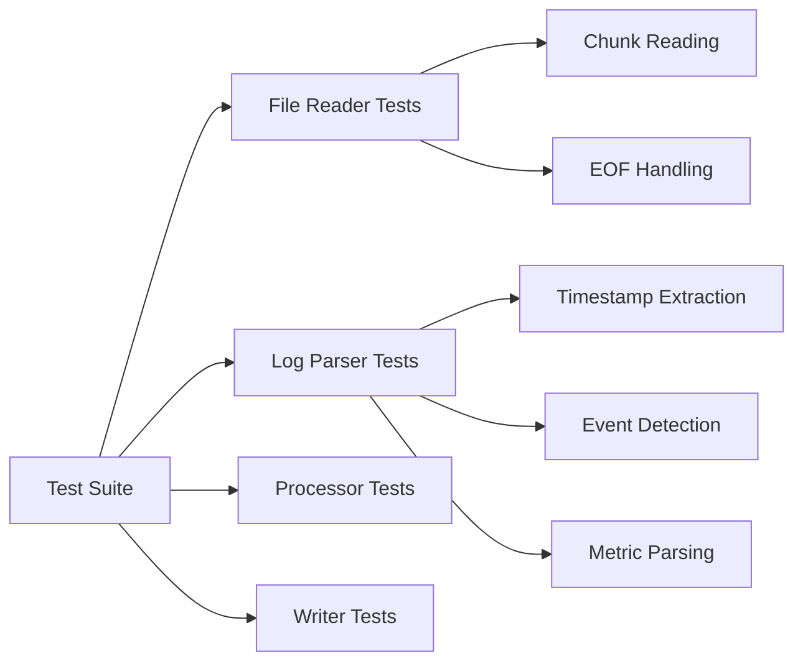

### Running Tests

```bash
# Method 1: Using unittest discovery
set PYTHONPATH=%CD%\src
python -m unittest discover -s tests -v

# Method 2: Using test runner
python tests/run_all_tests.py
```

### Test Coverage

* **Unit Tests**: Individual component functionality
* **Integration Tests**: Component interactions
* **Performance Tests**: Large file processing

## Versioning & Known Issues

### Version History

* Current: Initial release
* Features: Batch/live processing, file-based visualization outputs

### Known Limitations

* Log format assumes specific timestamp pattern
* Memory usage scales with queue size
* Visualization is produced as files for external tools (no built-in web UI)

## Data Schema

### Database Schema

The backend relies on a Microsoft SQL Server database designed for write-heavy workloads and efficient analytical queries.

#### Tables

*   **`Messages`**: Stores unique log message templates.
    *   Columns: `MessageId` (PK), `Template` (Unique), `CreatedAt`.
    *   Optimization: Normalizing templates reduces storage size and allows for efficient aggregation.
*   **`TimelineEvents`**: Stores individual log occurrences.
    *   Columns: `EventId` (PK), `EventTime`, `EventType`, `MessageId` (FK), `MessageValues` (JSON), `Value`.
    *   Indexes: `IX_TimelineEvents_EventTime`, `IX_TimelineEvents_EventType`, `IX_TimelineEvents_Pagination`.

#### Stored Procedures

*   **`sp_BulkInsertTimelineEvents`**: High-performance bulk insert of events.
*   **`sp_GetTimelinePage`**: Retrieves paginated timeline events with joined message templates.
*   **`sp_GetSummary`**: Calculates dashboard metrics in a single query.
*   **`sp_GetTimeseries`**: Generates time-series data for metrics.
*   **`sp_GetOrInsertMessage`**: Idempotent registration of message templates.

#### Views

*   **`vw_TimelineWithMessages`**: Denormalized view for easier querying.
*   **`vw_EventSummary`**: Pre-aggregated summary statistics.
*   **`vw_LatestEvents`**: Real-time monitoring view.
*   **`vw_ErrorsAndWarnings`**: Filtered view for issues.

## API Reference

The application exposes a RESTful API (built with Flask) to serve data to the frontend:

*   **`GET /api/summary`**: Returns high-level statistics (error counts, total events, latency metrics).
*   **`GET /api/timeline`**: Provides paginated access to the event timeline. Supports `page` and `per_page` parameters.
*   **`GET /api/timeseries`**: Retrieves timeseries data for specific metrics (e.g., latency). Requires a `metric` parameter.
*   **`GET /api/messages`**: Lists all unique message templates and their IDs.
*   **Swagger UI**: Available at `/apidocs/` for interactive exploration.

## Performance Optimization

### Tuning Parameters

```python
# For large files (>1GB)
CHUNK_SIZE=5000
NUM_PROCESSES=4
QUEUE_MAX_SIZE=50

# For memory-constrained systems
CHUNK_SIZE=1000
QUEUE_MAX_SIZE=10
```

### Best Practices

* Use SSD storage for large log files
* Monitor memory usage during processing
* Adjust workers based on CPU cores
* Use batch mode for historical analysis
* Use live mode for real-time monitoring

## Maintenance

### Cleanup

```bash
# Clear input/output directories
python bin/util_clear_dirs.py
```

### Monitoring

* Check output file sizes
* Monitor processing queue
* Validate JSON output format
* Review error counts in summary

## Future improvements

* Allow for keeping track of custom variables which change on triggers (defined by patterns) and change depending on set ACTION - DONE
* Live tail version - DONE
* Add proper logging using a logging library
* Test the entire app using better tests, not just the methods. Same input = same output
* Better runtime stats, maybe a simple analytics efficiency suite to ID bottlenecks
* Have better cleanup before running, don't use JSONL for variables, so it doesn't append the same IDs again -> allow for rerun
* Allow for ignoring certain message value tracking via .env
* Use a database instead of json files
* Improve configurability: allow for defining custom events

## Strategic Analysis

### SWOT Analysis

| **Strengths** | **Weaknesses** |
| :--- | :--- |
| **Performance:** Parallel processing handles GB-scale logs efficiently.<br>**Scalability:** SQL Server backend supports massive datasets.<br>**Flexibility:** Supports both batch and live tailing modes.<br>**Modularity:** Clean architecture allows easy extension. | **Complexity:** Requires SQL Server infrastructure.<br>**UI:** No built-in web dashboard (relies on API/external tools).<br>**Dependencies:** Heavier setup compared to simple grep/awk scripts. |

| **Opportunities** | **Threats** |
| :--- | :--- |
| **Cloud Integration:** Deploy as a serverless function or container.<br>**AI/ML:** Add predictive anomaly detection.<br>**Visualization:** Build a dedicated React/Next.js frontend.<br>**Ecosystem:** Create plugins for common log formats (Nginx, Apache). | **Competition:** Established enterprise tools (Splunk, ELK, Datadog).<br>**Adoption:** Users may prefer "all-in-one" SaaS solutions.<br>**Resource Intensity:** High CPU usage during peak processing. |
